# rc2014-inet

Internet tools for the RC2014 Pro running CP/M - https://rc2014.co.uk

See it in action at http://kobol.thelanbox.com.au:8080/

## Architecture

```mermaid
graph LR
    subgraph Internet["Internet"]
        WebClient["Web Browser"]
        Router["Internet Router"]
    end
    
    subgraph ESP8266["RC2014 WiFi Module"]
        WiFiSTA["WiFi Station Interface<br/>Dynamic IP"]
        
        subgraph lwIP["lwIP Stack"]
            NAPT["NAPT Engine<br/>NAT + Port Forwarding"]
            SlipNet["SLIP Interface<br/>192.168.1.1"]
        end
        
        TxQueue["TX Queue<br/>32 packets<br/>Rate limited"]
        SlipEnc["SLIP Encoder"]
        SlipDec["SLIP Decoder"]
        SerialESP["Serial UART<br/>115200 baud"]
    end
    
    subgraph Physical["Physical Layer"]
        RS232["RS-232 Connection"]
    end
    
    subgraph RC2014["RC2014 Z80 CP/M"]
        SerialRC["Serial UART<br/>115200 baud<br/>CP/M BDOS"]
        
        SlipLayer["SLIP Layer<br/>slip.c"]
        
        IPLayer["IP Layer<br/>ip.c<br/>192.168.1.51"]
        
        ICMPLayer["ICMP Layer<br/>icmp.c<br/>Ping support"]
        
        TCPLayer["TCP Layer<br/>tcp.c<br/>16 sockets, 4 listeners"]
        
        HTTPServer["HTTP Server<br/>http.c<br/>Port 80, 4 clients<br/>GET/HEAD methods"]
        
        CPMFiles["CP/M Filesystem<br/>HTML, CSS, JS, Images"]
    end

    %% Internet to ESP8266
    WebClient -->|HTTP| Router
    Router <-->|WiFi| WiFiSTA
    
    %% ESP8266 internal flow
    WiFiSTA <--> NAPT
    NAPT <--> SlipNet
    
    %% ESP8266 TX path
    SlipNet --> TxQueue --> SlipEnc --> SerialESP
    
    %% ESP8266 RX path
    SerialESP --> SlipDec --> SlipNet
    
    %% Physical layer
    SerialESP <-->|Full Duplex| RS232
    RS232 <-->|Full Duplex| SerialRC
    
    %% RC2014 stack
    SerialRC <--> SlipLayer
    SlipLayer <--> IPLayer
    IPLayer --> ICMPLayer
    IPLayer <--> TCPLayer
    TCPLayer <--> HTTPServer
    HTTPServer <--> CPMFiles
    
    %% Return paths
    ICMPLayer --> IPLayer
    
    style ESP8266 fill:#e1f5ff
    style RC2014 fill:#fff4e1
    style Internet fill:#f0f0f0
    style Physical fill:#e0e0e0
    style lwIP fill:#fff9c4
    style NAPT fill:#ffeb3b
```



## Tools

### HTTPD

A HTTP server which serves files from the current drive. Listens on the default port 80. It has a 1KB limit on request header size and only responds to GET and HEAD requests.

### PING

Rudimentary ping command. Current outputs a tcpdump-like debug log for all ICMP packets. No timing due to lack of RTC.

## SLIP Gateway

A NAT gateway that runs on the RC2014 WiFi module and provides internet connectivity to the RC2014 by bridgin WiFi to SLIP over SIO/2 port B.

## Run

Flash the gateway to your WiFi module and send `HTTPD.COM` to your RC2014. I have the programs on drive `C:` and the contents of www on drive `D:`. I then switch to drive `D:` and run `C:HTTPD` to serve files from there.

A tcpdump-like debug log can be output by calling `HTTPD -D`

## Build

Get z88dk from https://www.z88dk.org and then run the following command to build from source

```sh
./bin/httpd.sh
```

## Many thanks

I learned a lot from the following repos:
- https://github.com/jes/cpmhttpd
- https://github.com/saminiir/level-ip
